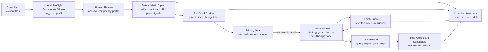

# Cipher Runtime Architecture

## Demo Talk Track

Cipher is not trying to make the data meaningless. It preserves the structure Claude needs for strategy: trend timing, query shape, page patterns, content constraints, and directional metrics.

The privacy boundary is simple: raw files, profile generation, preview, leak checks, and restoration all run locally. Claude only receives the approved scrubbed payload.